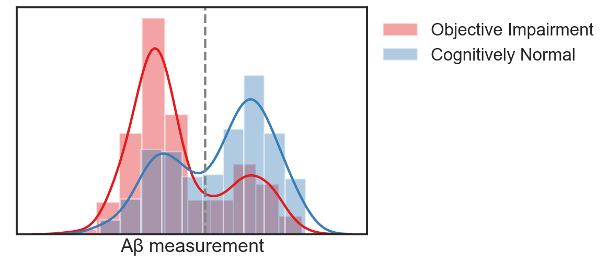
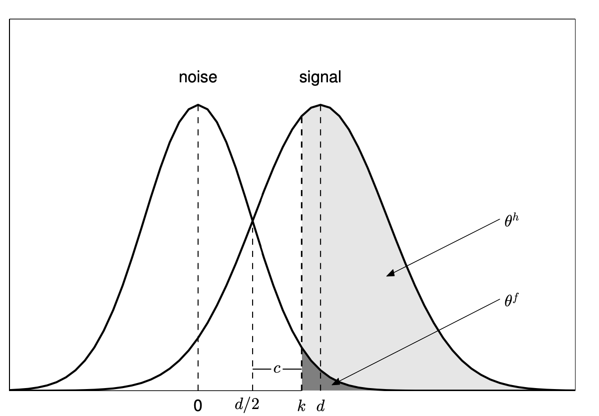
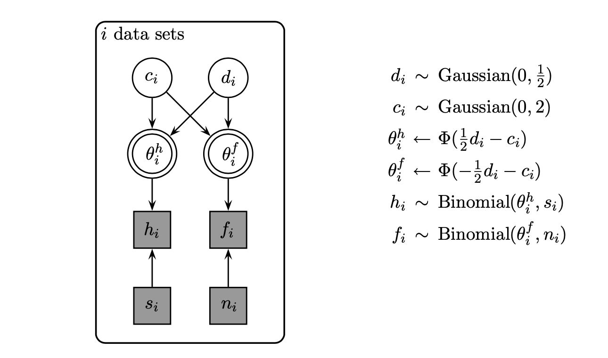
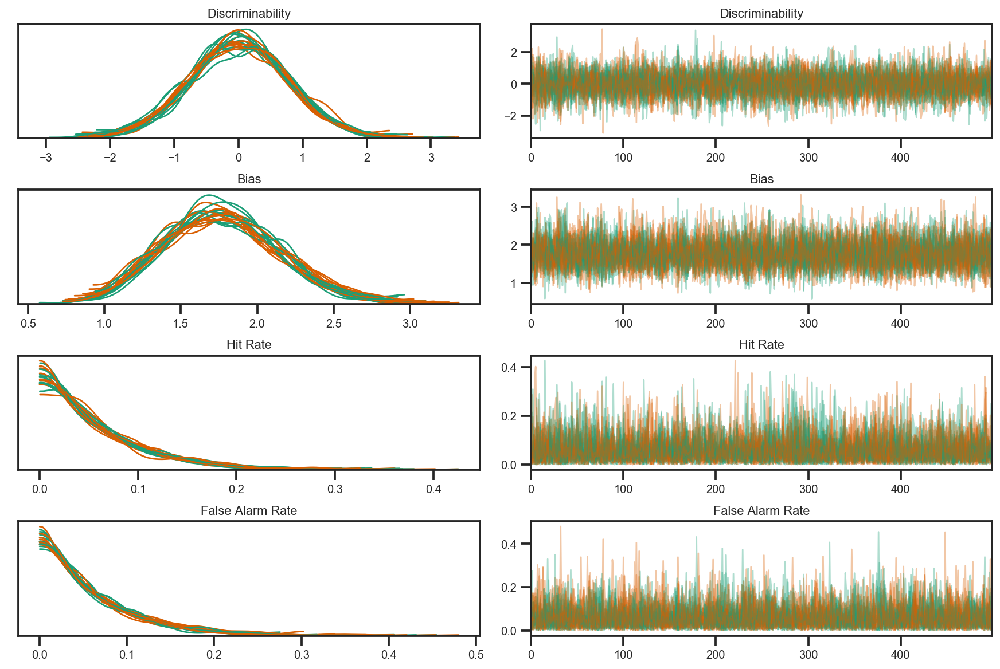
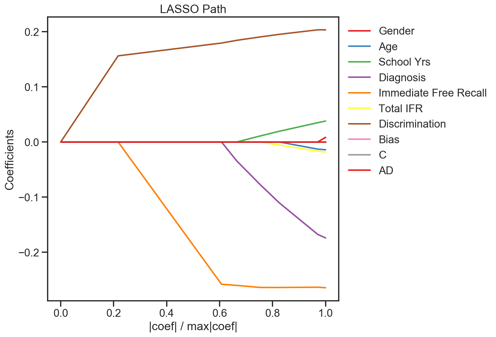

# Bayesian Cognitive Modeling

This experiment creates a Bayesian cognitive model from experimental data to predict amyloid positivity, which is a marker of Alzheimer's disease.



## Cognitive Science Background

### Signal and the Noise

Signal Detection Theory (SDT) literally studies how to separate signal from noise. More formally, how to separate information-bearing patterns from random noise. It is used to analyze decision making under uncertainty.

Ideal for forced choice experiments with two alternatives. Every choice the subject makes is either a "hit", "false alarm", "miss", or a "correct rejection." Specifically, we are interested in what criteria the decision-maker uses.



### Estimating Discriminability

All trials are generated from a Gaussian mixture of "signal" and "noise"
The subject can respond to a "signal" trial with either a "hit" or a "miss"
The subject can respond to a "noise" trial with either a "false alarm" or a "correct rejection"

## Probabilistic Modeling

### Modeling Discriminability with a Graphical Model



### Coding the Model with PyMC3


```python
with pm.Model() as model1:
    discriminability = pm.Normal('Discriminability', mu=0, tau=.5, shape=k)
    bias = pm.Normal('Bias', mu=0, tau=2, shape=k)

    theta_h = pm.Deterministic('Hit Rate', Phi((.5 * discriminability) - bias))
    theta_f = pm.Deterministic('False Alarm Rate', Phi(-(.5 * discriminability) - bias))

    N = np.ones_like(D.drec_hits) * 15

    hit_rate = pm.Binomial('hit_rate', p=theta_h, n=[15]*k, observed=D.hit_rate[:k])
    fa_rate = pm.Binomial('fa_rate', p=theta_f, n=[15]*k, observed=D.fa_rate[k])

    trace1=pm.sample(init='adapt_diag')
```

## Results

From the MCMC sampler:



LASSO results show features in order of importance for prediction:


